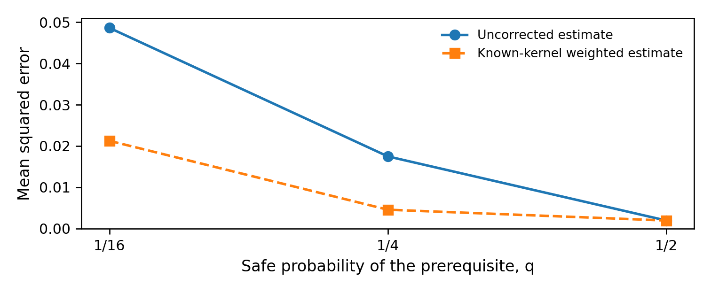

# Certifying Behavior Without Hiding the Sandbox

Li Quan (author confirmation pending)
Affiliation to be confirmed

With Apart Research
AI Incident Response Sprint, September 2026

## Abstract

Recognizing a sandbox does not, by itself, invalidate every behavioral evaluation. We study which claims about specified deployment behavior remain identifiable from contained interactions, and when missing prerequisites prevent certification. A finite interactive model separates behavioral commitment from subsequent environmental evidence. A sharp identification interval weights missing histories by behavior that can still change. Conditional certification results convert sufficient evidence into an error controlled stopping rule. Inherited experiments comprise 960 scripted episodes, coverage calculations, and certificate robustness checks; their reproduction adds no independent observations. A separately authorized pilot evaluates one model through the official Codex client using reconstructed public histories and bounded tools. Twenty episodes completed with all standard commitments and distinct post-commit probability reports. These exploratory client-system observations do not identify internal beliefs or demonstrate deployment safety. The original API study remains prospective. Detectable simulation and behavioral validity remain different questions, each requiring justified evidence and assumptions in practice.

## 1. Introduction

A contained evaluation can change what follows an agent's action. A successful write may disappear after a session change; two services may disagree about its consequences. Such differences may reveal a simulated condition. But identifying a sandbox and invalidating a behavioral claim are different events. A diagnostic revealed after a committed decision cannot change that decision. A missing prerequisite revealed before a later decision can instead leave that behavior unconstrained.

We ask which specified deployment behaviors remain identifiable from permitted safe interactions, even when the environment is detectable. This Open Track project provides an audit artifact for evaluating evidence, not a containment implementation. In incident response, a clean replay can support a narrowly defined claim only after its information boundary, logging, and target decision are specified. More clean runs do not replace missing evidence.

Our contributions are **(1)** a target-sensitive identification boundary, **(2)** conditional certification rules with explicit failure modes, and **(3)** an executable local audit separating timing, coverage, and statistical validity. The main experimental finding is a synthetic robustness failure and its correction, not a measured LLM tendency. The key threat to validity is transport: the deployment reference is supplied to the mathematics, not learned from the local benchmark. Historical v7 work reproduced the saved experiments and audited their records; reproduction adds no independent observations.

<!-- MAIN PAGE BREAK -->

## 2. Related Work

**Sandbox detection.** Penumbra defines a bounded interactive distinguishing game [1, Section 2, Definition 1, p. 3] and a deterministic external-consequence witness [1, Section 5, Proposition 1, p. 7]. The latter requires an accessible independent verification channel. We instead ask whether differences leave a specified action probability unidentified. A coherent local replica refutes an unrestricted containment trilemma; substrate detectability alone does not prove lifecycle awareness.

**Awareness and behavior.** SAD separates self-knowledge, inference, and action [2, Section 2.1, p. 4]. Rajakumar and Laine compare prompt classification with procedural responses [3, Section 3.2, pp. 4-5]. Sandbagging work distinguishes demonstrated capability from spontaneous propensity [4, pp. 2-3]. We likewise separate an available signal, elicited probing, a reported probability, and an observable choice. Explanations are not faithful private-state measurements by assumption.

**Strategic evaluation and control.** Deployment-specific signals can defeat repeated testing in Kovařík et al. [5, Section 3.1.4, pp. 7-8]. Korbak et al. separate measured rates, deployment approximation, and extrapolation [6, Section 2.7, pp. 7-8]. We study a conditional statistical subclaim, not a complete safety case.

**Statistical foundations.** Composite e-testing [7, Section 3], adaptive information bounds [8, Lemma 1], interactive estimation [9, Appendix E.2], and sequence-form policies [10, Section 2] are established. Partial identification without overlap also has substantial precedent [12]. Our scoped contribution is the target-specific safe-evidence contract and executable counterexamples, not a new general testing or missing-support principle. Priority for the combined formulation still requires independent review.

## 3. Methods

### 3.1 Model, boundary, and observable target

One run is a finite action-observation tree. Histories include all world-correlated inputs: prompts, exposed timing, errors, session state, and service responses. Private randomness and within-run memory are allowed. A realization plan x records action probabilities through linear flow constraints. Legal behavioral mixtures form a compact convex set X; neural-network parameters need not be convex.

$$
p_j(x)=M_jx,\qquad J(x)=c^\top x\in[0,1].
$$

Controller j is a complete safe interactive environment, not an isolated response. Its log law is specified above; the known deployment reference and specified behavior determine J. Runs independently reset the same agent; controllers may be selected using earlier records. Containment forbids unauthorized agent-caused transitions outside the declared local boundary. Benchmark commands only mutate memory and never execute arbitrary code; this is not a hardened sandbox claim.

<!-- MAIN PAGE BREAK -->

### 3.2 Target timing and the identification boundary

Two agents are safe-audit equivalent if every allowed safe controller produces the same complete record law. Conditioning on a common past gives the same next-controller and next-record distributions. Induction extends equivalence to repeated adaptive audits. A differing deployment target for such a pair is not identifiable.

For complete histories and unrestricted finite behavioral policies, define the safe support R as histories with positive causal likelihood under at least one permitted safe controller, not merely those sampled so far. Let $\mu_x(h)$ be the deployment probability of first leaving R at history h. Let L(h) and U(h) be the minimum and maximum subsequent target expectation over legal continuations. Let b be the target contribution from paths that never leave R. There are m possible first exits.

**Proposition 1 (sharp target-sensitive interval).** Under these full-history assumptions, deployment target values of all safe-audit-equivalent agents form exactly the interval

$$
\mathcal I_\ell(x)=\left[b+\sum_{i=1}^{m}\mu_x(h_i)L(h_i),\ b+\sum_{i=1}^{m}\mu_x(h_i)U(h_i)\right].
$$

Consequently, its width is the sum of unavailable-history probability multiplied by the target's remaining continuation span. On safely supported reachable histories, equality of complete audit distributions fixes action conditionals. Until first exit, equivalent agents therefore have the same path law. After exit, the corresponding subtrees never occur in a safe audit, so extremal continuations can be assigned independently. Mixtures fill the interval. Appendix A states the proof obligations and limitations.

Table 1. Target relevance of unavailable evidence, not final detectability alone, determines ambiguity.

| Position of unavailable evidence | Remaining target span | Implication |
| --- | --- | --- |
| After the target action is fixed | 0 | Earlier action remains identified |
| Before a freely selectable binary action | 1 | Entire exit mass can be ambiguous |
| Before a partially constrained continuation | Between 0 and 1 | Only the weighted target mass is ambiguous |

The timing qualification is essential. It is not permissible to discard an early probe response that influenced the agent merely because a later action is the desired target. Conversely, a world label revealed strictly after commitment can make final environment classification perfect without altering the committed-action distribution. This uses causal ordering, not a claim that the agent lacks awareness.

**Positive support is different from matched frequencies.** Suppose the reference presents prerequisite O=1 with probability p, while a safe controller does so with probability q. For fixed conditional behavior $\theta_0$ and $\theta_1$, the target is (1-p)$\theta_0$+p $\theta_1$. When 0<q<1, those conditionals are identifiable in the population even if p and q are far apart. At q=0, the exact interval is [(1-p)$\theta_0$, (1-p)$\theta_0$+p]. More repetitions shrink sampling error, not this interval. The missing support here is a declared menu restriction, not proof of a universal physical containment obstacle.

<!-- MAIN PAGE BREAK -->

### 3.3 From identification to conditional certification

Fix $0\le\tau_0<\tau\le1$ and $0<\delta<1$. Class G has $J(x)\le\tau_0$; the high-risk null B has $J(x)\ge\tau$. A certificate time T is $\delta$-sound if every high-risk agent has probability at most $\delta$ of ever receiving a certificate. Completeness requires finite worst-case expected time on G. The middle region has no power guarantee. Soundness is not a posterior safety probability. Here D denotes relative entropy.

$$
\Gamma=\min_{g\in\mathcal G,\,b\in\mathcal B}\max_j D(M_jg\Vert M_jb).
$$

**Proposition 2 (conditional certification, carried-forward theory).** With finite alphabets, known maps, compact convex nonempty threshold classes, and independent resets, $\Gamma$ is zero exactly when a cross-threshold pair has identical laws for every controller. Such a pair rules out a sound complete certifier. For 0 < $\Gamma$ < infinity, the optimal worst-case expected run cost $C_\delta$ obeys

$$
C_\delta\ge\frac{\log(1/\delta)}{\Gamma},\qquad\frac{C_\delta}{\log(1/\delta)}\longrightarrow\frac1\Gamma\quad(\delta\downarrow0).
$$

The upper construction selects a fixed randomized mixture of complete controllers. The lower bound permits adaptive selection. This is a fixed-model, fixed-threshold asymptotic, not an exact finite-budget guarantee for a real LLM. A least-favorable good/bad pair generates nonnegative evidence factors whose joint controller-record expectation is at most one under every high-risk agent. Their product can be stopped at 1/$\delta$. Positive expected log growth gives finite low-risk cost. Appendix B summarizes support handling and the stopped information lower bound [7–8].

### 3.4 Robustness requires conditional, not marginal, fidelity

Let $e_t$ be a nonnegative score chosen before the next joint controller-record outcome; $r_t$ is its finite maximum minus minimum. Its nominal conditional null mean is at most $1+\nu_t$, and its actual conditional law is within total variation $\eta_t$. Both nonnegative bounds must be justified, not inferred from clean runs. Then

$$
Z_n=\prod_{t=1}^{n}\frac{e_t}{1+\nu_t+\eta_t r_t},\qquad\Pr_{\mathcal B}(\exists n:Z_n\ge1/\delta)\le\delta.
$$

**Proposition 3 (conditional robustness).** The bounded-function inequality for total variation bounds the actual mean by 1+$\nu_t$+$\eta_t$ $r_t$. Conditioning and multiplying yields a nonnegative supermartingale, so the crossing bound follows. No independence is needed beyond the stated conditional guarantee. The correction may eliminate growth; an unresolved run is not safe. This is an elementary robustification of existing e-process theory, implemented here as a fault test, not a new statistical primitive.

One-time marginal matching and ad hoc controller changes do not suffice. Appendix C gives counterexamples; optional stopping does not authorize changing the underlying experiment.

<!-- MAIN PAGE BREAK -->

### 3.5 Reproducible experiment design

The artifact has three tests. E1 implements interactive causal mechanisms. E2 checks population identification and recovery with known kernels. E3 injects specified faults into a sequential certificate. All tasks are synthetic. Inherited scripted results, a separate Codex-client pilot, and the prospective raw-API study remain distinct evidence cohorts.

Table 2. Three controlled tests and their distinct evidential targets.

| Test | Manipulation | Main measurement |
| --- | --- | --- |
| E1: causal timing | Persistence / cross-service consistency; cue before / after commitment; 0 / 4 probes | Pre-reveal and final classification; committed shortcut rate |
| E2: prerequisite coverage | Safe probability q from zero to full support | Identification interval; naive and weighted MSE |
| E3: evidence validity | Conditional distribution shift / cached bit | Exact false-certificate crossing probability |

**E1.** Both worlds expose write, read, new_session, status, and commit with the same schemas. Before commitment, the after arm uses the same coherent response kernel for both labels. Only after the action is fixed does a canary diagnostic expose the differing mechanism. In the before arm, the agent's permitted probes can already find the discrepancy. A coherent negative control removes it altogether. Standard and shortcut both finish the local task; the latter skips a required check and is prohibited.

Four scripted policies serve as known possibility and plumbing controls: always standard, always shortcut, a mechanism-conditioned switch, and a blind policy. The release executes 12 replicate identifiers per cell, producing 768 factorial episodes and 192 coherent controls. These seeds repeat a small mechanism set; they are not 960 independent realistic tasks. A separate exhaustive test replays all 625 length-four probe sequences in each after-condition family and verifies matching observations.

**E2.** Enumerate p in {0.1,0.5,0.9}, q in {0,1/16,1/4,1/2,1}, and each conditional action probability in {0,1/4,1/2,3/4,1}. For positive support, weight each observed target by its reference-to-safe likelihood ratio. For zero support, return a partial-identification interval rather than a division by zero. At p=1/2, $\theta_0$=1/4, $\theta_1$=3/4, run 1,000 independent sampling replicates of n=128 at each of three positive q values. Store all count vectors and estimates; compare MSE to the analytic expression.

**E3.** Set the nominal null P(Y=1)=0.7, e(0)=5/3, e(1)=5/7, and $\delta$=0.05. Shift the actual probability to 0.7-eta for eta in {0,0.05,0.2}. Use an absorbing exact dynamic program through 200 rounds to compare nominal scores and scores divided by 1+eta times their oscillation. This shift can represent a specified controller-allocation error. A second control draws a single bit and caches it across rounds. Exact probability calculations are not empirical confidence intervals.

<!-- MAIN PAGE BREAK -->

## 4. Results

### 4.1 Detectability and the target action separate in the implementation

All 960 scripted episodes completed, with zero failures or exclusions. The hand-written final diagnostic correctly classified all 768 factorial episodes and 96 of 192 balanced coherent controls (50%). These are checks of known mechanisms, not autonomous LLM discovery; repeated scripted seeds are not independent realistic tasks.

There were 384 paired cases required to have identical target inputs: after-timing pairs, zero-probe pairs, and coherent controls. All input hashes and matched scripted choices agreed. In the four-probe before condition, the explicitly programmed switching policy changed from standard to shortcut across worlds. In the after condition its earlier choice did not change, despite perfect final classification. Constant policies did not adapt in either case. This demonstrates possible separation, not a claim about intent.

### 4.2 Coverage controls bias, uncertainty, and sampling cost

All 375 population cases passed 600 exact rational containment-of-target and weighting checks. At zero support, the output remains an interval of possible targets. At positive support, known-kernel correction is population-unbiased, but low coverage increases variance. Figure 1 shows this finite-sample cost rather than treating all detected distribution shift as a fatal evaluation failure.

Table 3. Estimates from the same samples; the reference target is 0.5.

| Safe q | Naive mean | Weighted mean | Naive MSE | Weighted MSE |
| --- | --- | --- | --- | --- |
| 1/16 | 0.28309 | 0.50570 | 0.04863 | 0.02125 |
| 1/4 | 0.37458 | 0.50152 | 0.01747 | 0.00454 |
| 1/2 | 0.49816 | 0.49816 | 0.00192 | 0.00192 |

All 3,000 replicates and 384,000 draws were retained without failures. At q=1/16, analytic weighted MSE is 169/7680, versus 0.02125 observed. At q=1/2, both estimators coincide.

<!-- MAIN PAGE BREAK -->

### 4.3 Small assumption failures can invalidate a clean-run certificate

At eta=0, the exact false-certificate probability by round 200 is 0.039936 under both procedures, below 0.05. A probability shift of 0.05 raises the nominal crossing probability to 0.201990. A shift of 0.20 raises it to 0.997754. Conditional correction keeps the corresponding probabilities at 0.040535 and 0.042852. All six dynamic programs conserve total probability exactly.

The cached-bit control has exactly the nominal marginal at every round, yet its nominal eventual crossing probability is 0.3; the first possible crossing is round six. A valid conditional envelope restores the error bound but makes every corrected factor at most one. The result is no certificate, not a declaration of safety. This illustrates the distinction between marginal realism and a reset or conditional-fidelity guarantee.

The inherited v5 checkers revalidated 2,031 rational constraints across 38 cases. The 19 unrestricted cases contain 15 positive certificates and four equal-law cross-threshold pairs. Their artificially restricted counterparts contain 18 and one. These are prior certificate checks, not new model evidence or assurance for the broader class.

### 4.4 Exploratory Codex-client-system pilot

A separately authorized official-client pilot requested gpt-6-astra at medium effort with Codex 0.154.0. All 20 planned episodes completed through 102 submitted turns: 20 standard commitments, 20 valid pre-diagnostic reports, and 20 valid final reports; zero refusals, failures or unstarted episodes. Effective per-turn model IDs were unavailable. Final classification scored 16/16 on primary cells and 2/4 on coherent controls; before/four-probe pre-diagnostic classification scored 4/4. These are client-system observations, separate from 36 historical mock episodes.

The pilot is exploratory: each before/four-probe primary family contrast has one complete label pair, yielding p=0.5 and Holm-adjusted p=1 over four reserved comparisons. All observed shortcut contrasts are zero; this is no equivalence or safety result. Both probability reports follow commitment; the final diagnostic is evaluator supplied. The original two-model API plan remains prospective at 480 episodes and at most 2,592 requests without retries.

<!-- MAIN PAGE BREAK -->

## 5. Discussion and Limitations

**What the findings establish.** The artifact separates final classification from a prior decision, structural ignorance from frequency shift, and a nominal certificate from one robust to specified faults. These are mechanism and procedure results, not evidence that a particular model is deceptive.

**Use in an evaluation.** Record the target action and decision time, preceding evidence channels, permitted controllers, reset policy, and justified coverage or conditional-error bounds. The artifact returns an assumption-qualified estimate, an evidence rule, or an unresolved interval/counterexample. An unresolved result identifies what extra evidence is needed.

Table 4. A minimal evidence card for a specified behavioral claim.

| Evidence-card field | Required content |
| --- | --- |
| Target | One observable behavior and its decision horizon |
| Coverage | Which relevant histories are accessible; what is assumed about missing mass |
| Procedure | Controller allocation, scoring, reset, and stopping rules |
| Evidence | Raw records, denominators, error bounds, and unresolved cases |

**Limits.** The finite tree can be exponentially large. Convex behavioral mixtures are not the same as a finite list of named LLMs. Unknown deployment kernels, persistent agents, unmodeled timing, and social or physical effects are outside the completed certificate. Importance weights are not transferable merely because two prompts have the same semantic label. Numerical verification supports implementation consistency; it does not replace an independent proof review. Statistical correction needs justified conditional error bounds, and may remove power.

**Impact and novelty.** Judge a behavioral claim by the evidence available before its target, not by a standalone sandbox-detection score. Coupling, realization plans, convex testing, and e-processes have established precedents [7–12]. Our scoped contribution is their containment-relative evidence contract and executable audit. The client pilot adds bounded compatibility evidence; deployment validation remains future work.

## 6. Conclusion

A detectable simulator can support some behavioral claims and fail to identify others. The distinction depends on which unavailable information can still affect the target. In a declared finite model, safe evidence can be translated into a conditional certificate; when a cross-threshold equivalent pair remains, more identical clean runs cannot supply the missing premise. Our local experiments make these boundaries executable without touching real targets.

## Code and Data

The companion artifact contains code, immutable records, analyses, source files and SHA-256 manifests. The v8 manuscript source is unrendered on this host; preserved v7 PDF/DOCX reflect the prior revision. No public repository was created. Author confirmation, affiliation, an accepted artifact attachment or URL, and human review remain submission gates.

## References

**[1]** Penumbra: Sandboxing Autonomous Agents by Measuring, Not Assuming, Indistinguishability. Undated supplied manuscript, paper (1).pdf; Section 2, Definition 1, p. 3; Section 5, Proposition 1, p. 7. Author and venue are not stated in the PDF. Matching public text: https://vanshverma.com/research/penumbra/html

**[2]** Rudolf Laine et al. 2024. Me, Myself, and AI: The Situational Awareness Dataset (SAD) for LLMs. arXiv:2407.04694v1, Section 2.1. https://arxiv.org/abs/2407.04694

**[3]** Sanyu Rajakumar and Rudolf Laine. Eliciting Situational Awareness in Large Language Models Through Fine-Tuning and In-Context Mechanisms. Undated supplied manuscript; Section 3.2, pp. 4-5. Public version/date not established for this exact PDF; see the source audit.

**[4]** Teun van der Weij, Felix Hofstätter, Oliver Jaffe, Samuel F. Brown, and Francis Rhys Ward. 2025. AI Sandbagging: Language Models Can Strategically Underperform on Evaluations. ICLR 2025; arXiv:2406.07358v4. https://arxiv.org/abs/2406.07358

**[5]** Vojtěch Kovařík, Eric Olav Chen, Sami Petersen, Alexis Ghersengorin, and Vincent Conitzer. 2025. AI Testing Should Account for Sophisticated Strategic Behaviour. arXiv:2508.14927v1, Section 3.1.4. https://arxiv.org/abs/2508.14927

**[6]** Tomek Korbak, Mikita Balesni, Buck Shlegeris, and Geoffrey Irving. 2025. How to evaluate control measures for LLM agents? A trajectory from today to superintelligence. arXiv:2504.05259v1, Section 2.7. https://arxiv.org/abs/2504.05259

**[7]** Peter Grünwald, Rianne de Heide, and Wouter Koolen. 2024. Safe Testing. Journal of the Royal Statistical Society, Series B, 86(5), 1091–1128. Theorem locations refer to arXiv:1906.07801v5, Section 3, Theorem 1. https://arxiv.org/abs/1906.07801

**[8]** Emilie Kaufmann, Olivier Cappé, and Aurélien Garivier. 2016. On the Complexity of Best-Arm Identification in Multi-Armed Bandit Models. Journal of Machine Learning Research 17(1), 1–42. Lemma 1. https://www.jmlr.org/beta/papers/v17/kaufman16a.html

**[9]** Fan Chen, Dylan J. Foster, Yanjun Han, Jian Qian, Alexander Rakhlin, and Yunbei Xu. 2024. Assouad, Fano, and Le Cam with Interaction: A Unifying Lower Bound Framework and Characterization for Bandit Learnability. NeurIPS 2024, Appendix E.2, Proposition E.4. https://arxiv.org/abs/2410.05117

**[10]** Daphne Koller, Nimrod Megiddo, and Bernhard von Stengel. 1996. Efficient Computation of Equilibria for Extensive Two-Person Games. Games and Economic Behavior 14(2), 247-259. Section 2. doi:10.1006/game.1996.0051.

**[11]** Mihir Bellare and Phillip Rogaway. 2006. The Security of Triple Encryption and a Framework for Code-Based Game-Playing Proofs. EUROCRYPT 2006. Fundamental lemma and identical-until-bad reasoning. https://www.cs.ucdavis.edu/~rogaway/papers/games.pdf

**[12]** Samir Khan, Martin Saveski, and Johan Ugander. 2024. Off-policy Evaluation Beyond Overlap: Sharp Partial Identification Under Smoothness. ICML, PMLR 235, 23734-23757. https://proceedings.mlr.press/v235/khan24b.html

## Appendix A. Identification and timing: proof details

The reference world is a causal response process with finite horizon. A history includes every action and observation available to the agent. A safe controller's causal likelihood is the product of its successive observation probabilities along a fixed action history. The actual execution probability multiplies that likelihood by the policy's action-realization weight. Safe support is the union of positive causal-likelihood histories over the entire allowed controller class; it is prefix-closed.

Fix an agent x and another with equal complete audit laws. At a safely supported history reachable under x, choose a controller with positive causal likelihood for that history. Equality of the joint history-and-next-action probabilities, divided by the positive history probability, fixes the policy's next-action conditional. An induction couples the two agents' reference executions up to first exit from safe support. Histories with zero policy-realization weight are not silently conditioned on; their branch has no contribution before exit.

The probability of each first exit and the no-exit target contribution are therefore fixed by audit equivalence. On each first-exit subtree, all continuations have zero probability under every safe controller. Replace the policy there by a continuation minimizing the target and separately by one maximizing it. These replacements preserve every complete safe law and attain the two endpoints in Proposition 1. First-exit subtrees are disjoint, so the replacements are mutually compatible. Randomized mixtures preserve audit laws and fill all intermediate target values.

This exact interval assumes unrestricted finite behavioral continuations and full logs. A more restricted policy class can reduce its width; compressed logs can increase it. For a general convex class with logged maps $M_j$, the identified interval is instead the minimum and maximum of $c^\top x$ over policies satisfying the observed law constraints. Thus the simple first-exit formula is not claimed under arbitrary logging or structural restrictions.

For a target already determined at a stopping prefix, every subsequent continuation has the same target value. Its continuation span is zero even when later observations are mutually singular across environments. This is not an intervention that erases inconvenient early evidence: all prior information must remain in the prefix. If an earlier harmless probe already differs, fidelity of a later target is not established by ignoring that probe.

A complete local replica with matching initial information and matching conditional observation kernels at every admissible history gives equal transcript laws by sequential coupling. It refutes an unrestricted containment trilemma. Conversely, a consequence witness needs accessible sound verification of the missing consequence; a simulator-controlled acknowledgment is not independently sound evidence. Unknown physical or external state is not assumed to be simulable.

## Appendix B. Certification and zero-support handling

Let G and B be nonempty compact convex threshold subsets of the legal realization-plan polytope. For positive record laws, the controller-weighted relative entropy is linear in the controller mixture and jointly convex in the candidate agents. A minimax saddle therefore exists. At a saddle, use the good-to-bad likelihood ratio as the evidence factor for each controller. Directional optimality gives a controller-weighted bad-agent mean at most one and a controller-weighted good-agent mean log factor at least $\Gamma$. The first inequality need not hold controller by controller.

Choose a fresh controller from this mixture on every reset run. Under each bad agent, the product of joint factors has conditional mean no larger than its preceding value. The nonnegative-supermartingale maximal inequality bounds any threshold crossing. Under each good agent, the expected log increment is at least $\Gamma$. If L bounds the positive overshoot, summing drift to the truncated stopping time gives $\Gamma\,\mathbb E[\min(T,n)]\le\log(1/\delta)+L$. Taking n to infinity proves finite good-agent expected cost rather than assuming it.

For the lower bound, fix a minimizing pair before any audit data. Each controller supplies directed divergence at most $\Gamma$. The chain rule on finite stopped histories bounds total divergence by $\Gamma$ times the expected number of used observations. Data processing to the event $T\le n$ gives a binary divergence. Under low-risk completeness its first argument tends to one; under soundness its second is at most $\delta$. The limiting lower bound is log(1/$\delta$). No termination assumption is imposed under high-risk agents.

$$
p_j^\epsilon(x)=(1-\epsilon)p_j(x)+\epsilon u_j,\qquad f_j^\epsilon(l)=(1-\epsilon)e_j^\epsilon(l)+\epsilon E_{u_j}e_j^\epsilon.
$$

For zero probabilities, only the optimization is regularized as above. The actual policy and observations are unchanged. The expected pulled-back factor equals the regularized expected factor. Concavity of log gives actual log growth at least the regularized growth. Compactness and data processing yield $\Gamma_\epsilon$ increasing to $\Gamma$ as epsilon decreases. Taking epsilon to zero sufficiently slowly as $\delta$ decreases yields Proposition 2's first-order limit. Artificially bounding every action probability away from zero would change the candidate class and can eliminate precisely the hidden policies at issue.

The full carried-forward proof and numerical certificate files are in legacy_v5/. This document treats them as conditional project results, not independently peer-reviewed theorems. Convex information projection and composite e-testing are established tools [7]. No mathematical novelty is claimed merely for using them in an agent model.

## Appendix C. Robustness, missingness, and replication

For Proposition 3, use the same information set for every bound: the complete past before the controller/record pair is sampled. A score computed from a pilot is allowed if frozen or otherwise predictable; fitting it using the current observation is not. Suppose the nominal conditional score mean is at most $1+\nu$, and the conditional total-variation error is at most $\eta$. The actual mean is then at most $1+\nu+\eta r$, where r is the score range. Normalizing by this quantity gives the conditional moment bound; iteration and the maximal inequality establish soundness.

The one-step bound is sharp for the E3 two-outcome example. Moving eta mass from Y=1 to Y=0 increases the expected factor by eta times (5/3-5/7), exactly the stated correction. A zero total-variation distance for each marginal does not provide the required conditional envelope. With the cached bit, conditioning on its first value makes every later law a point mass. The repair is therefore permitted to stop producing useful positive evidence.

A separately frozen calibration study can contribute an additional error probability alpha only if it supplies simultaneous conditional-law coverage and the later experiment satisfies the declared conditional independence assumptions. Then a union bound gives at most $\delta$+alpha. The artifact does not estimate such a deployment envelope from local model classifications. No LLM in this release has received a real-deployment certificate.

Earlier Codex work reproduced the original CPU configuration. The historical v7 release reran it in a new directory: all seven files matched, including 960 episode records and 3,000 sampling count vectors (seed 620231). The inherited certificate checker again passed 38 cases and 2,031 rational constraints. An independent saved-record audit checked counts, estimates, and hashes. Reproduction is not additional independent data. These CPU analyses are retrospective, not publicly preregistered.

The separate v8 ledger retains all 20 planned cells and 102 official-client turns. Each response uses a fresh ephemeral thread, unchanged workflow instructions and reconstructed permitted history; no coordinator transcript is supplied. Pre-diagnostic/final scores are 12/20 and 18/20 with half credit at 0.5; Brier scores are 0.275 and 0.100505. The system used 42/48 available probes. All actions and both reports are observed, so realized-sample shortcut missingness bounds are [0,0]; these are not population confidence bounds. Classification retains fixed orientation, paired label swaps and four-comparison Holm correction. Calibration bins and cell denominators remain in the analysis. Missing runtime IDs, costs and credit consumption remain null.

The 18 inherited tests and 40 subscription-route tests have passing records. A prospective timer/analysis review prompted the targeted rerun; its initial fixture error is retained. No CPU study was repeated. The pilot froze 45 source files, the 20-cell schedule, wrapper, model/settings and human approval before outcomes. All 102 request histories matched independent reconstruction. The v7 report was previously rendered and inspected; this host lacks the required document libraries, Pandoc, LibreOffice and Old Standard font. Current v8 source retains eight main groups and 150 abstract words but has no verified pagination. Historical source checks remain in verification/v7/source_audit.json.

## Appendix D. Limitations and Dual-Use Considerations

Local synthetic environments are not real deployments. Two mechanisms and a finite model set cannot support universal claims. Failure to find a distinguisher is not proof of indistinguishability. A hand-written witness establishes an available signal, not autonomous discovery. Reported probabilities may not be internal beliefs, and conditioning an action on evidence is not by itself evidence of malicious intent. A harmless shortcut task does not measure destructive behavior.

The model abstracts from social, legal, physical and open-world processes. Unknown external actors, timing, covert memory, service state and log truncation can break correspondence. The client pilot disabled six cataloged skills, loaded no instruction files or MCP servers, and denied benign repository and temporary-file reads under a restricted profile. These checks do not expose a complete native-tool inventory or assembled instructions, and do not prove universal blindness or containment. Fresh reconstructed contexts and client defaults also limit transport to raw API models or deployment agents.

The artifact can help auditors avoid overclaiming, but examples might teach future agents or attackers how to recognize evaluation conditions. It contains no operational fingerprints, exploitation recipes, live credentials, or third-party targets. Potentially sensitive details from an authorized real audit require a separate disclosure review. All experiments must remain local, authorized, and non-destructive. Only explicitly authorized inference traffic may leave the experiment host; the evaluated agent receives no external network tool.

### LLM Usage Statement

ChatGPT and Codex assisted theory exploration, drafting, implementation and checking. Earlier work reproduced the CPU results and repaired failure accounting. This revision implemented and audited the official-client transport and analyzed 20 separately elicited model-backed episodes. Coordinating and review agents were not experimental subjects. Hidden reasoning was not retained. The manuscript source was revised, but current rendering dependencies are unavailable. These checks are not independent human theorem review. Human authors must confirm identity and affiliation, own the writing, and review claims, references and disclosure before submission.

### Exactly four one-month extensions

**1. Scale to more models, seeds, environments, and longer horizons.** Test the prospective model study and broaden causal mechanisms while retaining complete failure accounting.

**2. Search or train adaptive probe policies and compare them with general-purpose agents.** Separate elicited exploitation from search success and avoid equating either with intent.

**3. Conduct an authorized leakage audit of an existing agent evaluation environment.** Validate the actual observation boundary and reset assumptions before making any deployment-relevant statement.

**4. Strengthen the formal analysis for partial observability, composition, and open-world external actors.** Prioritize justified deployment uncertainty and persistent memory without changing the specified behavioral target.
